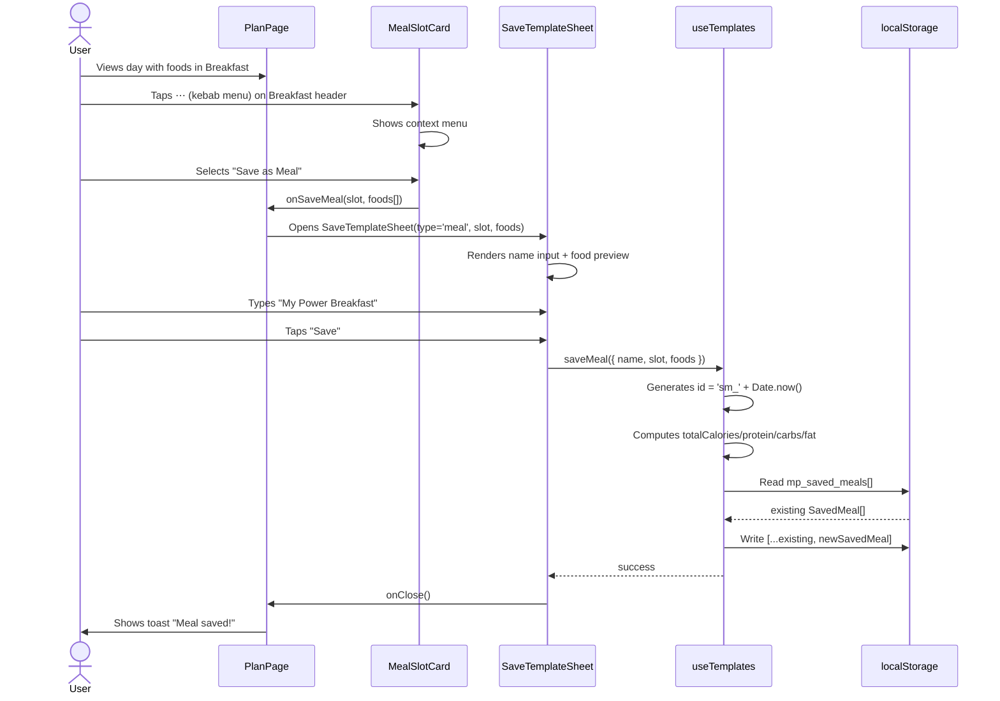
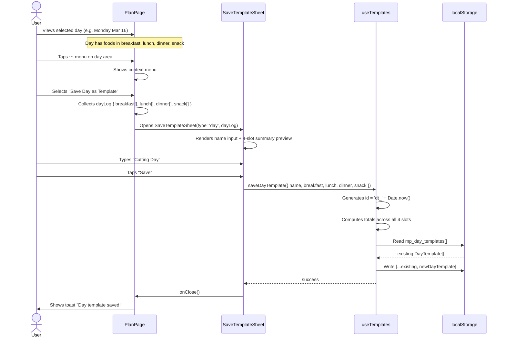
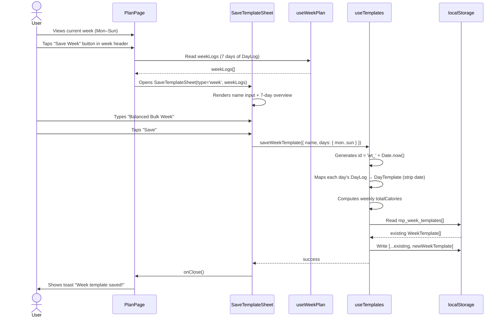
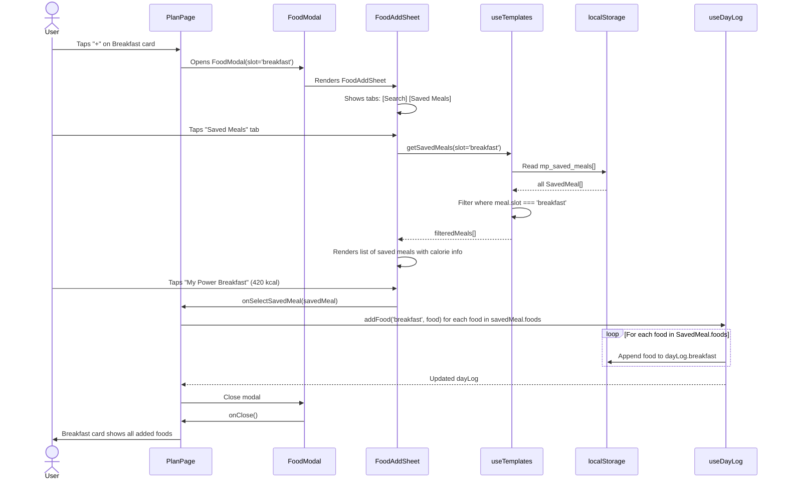
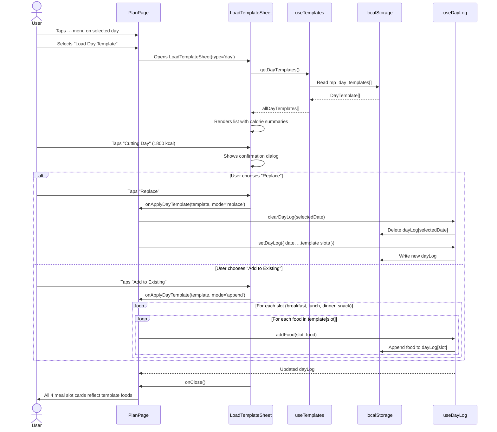
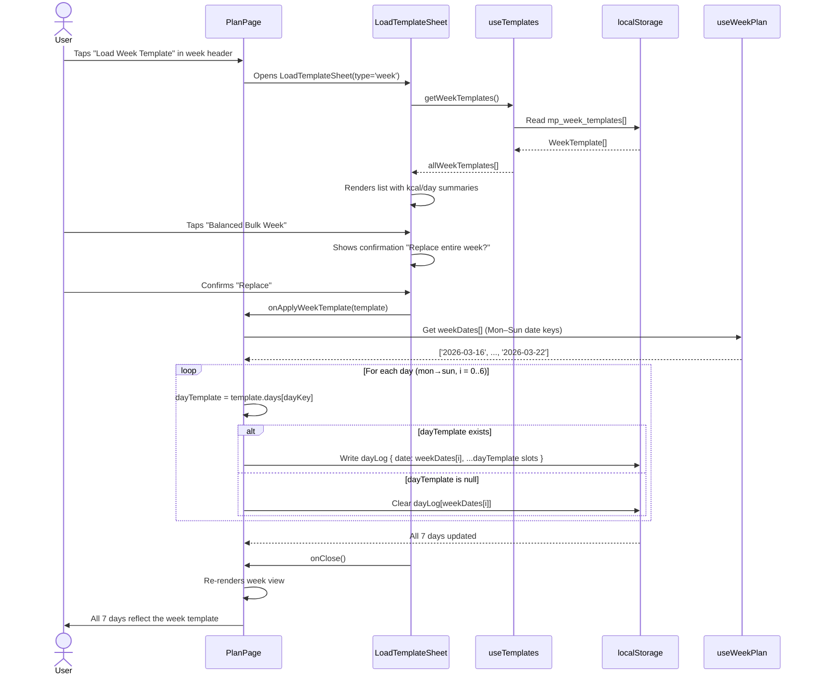
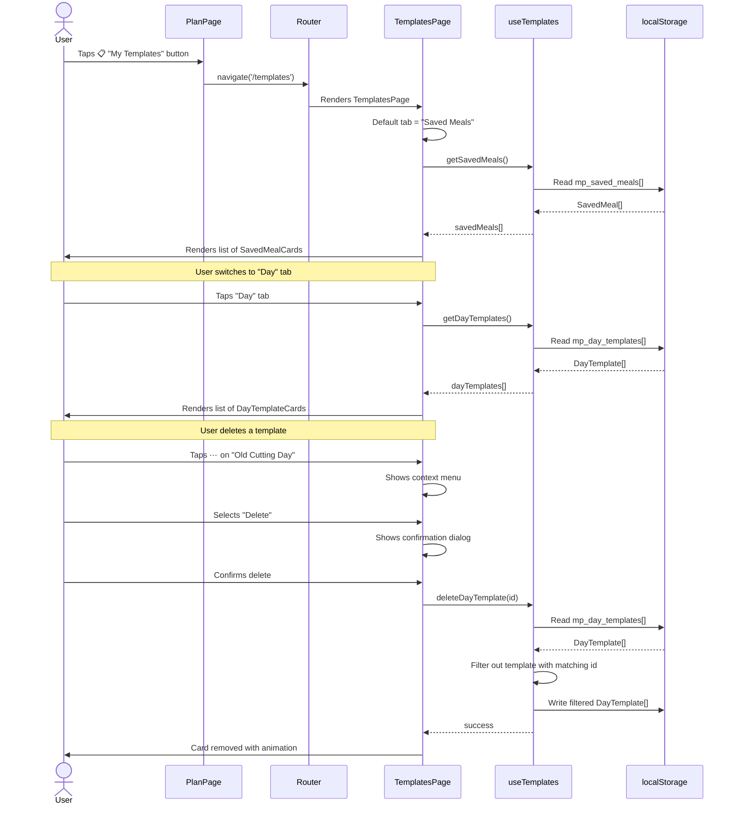
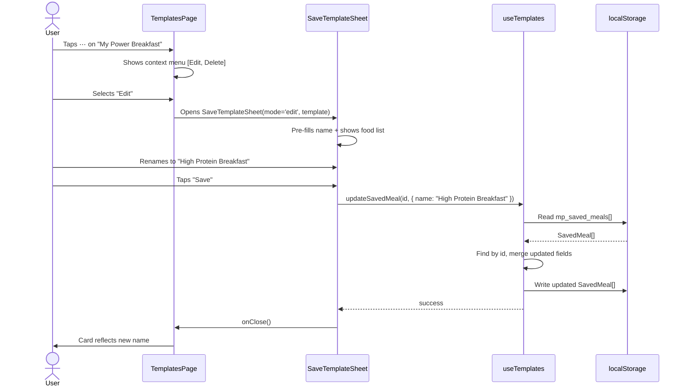
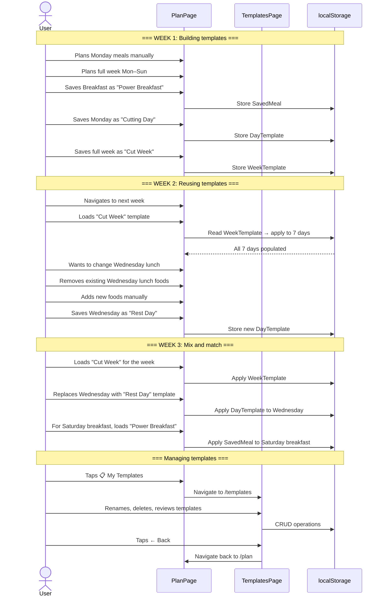

# 🔬 Research: Meal Template / Preset System

## 1. Industry Terminology

After researching popular nutrition & meal planning apps (MyFitnessPal, Eat This Much, Lifesum, MacroFactor, Cronometer, Mealime, FatSecret, Strongr Fastr), here are the standard terms used for each level of saved meals:

| Your concept | Industry standard name | Also known as | Used by |
|---|---|---|---|
| Group of foods saved for a slot (breakfast/lunch/dinner/snack) | **Saved Meal** | "Quick Meal", "Meal Preset", "Meal Combo" | MyFitnessPal, FatSecret, Lifesum |
| A full day's meals across all slots | **Day Template** | "Day Preset", "Meal Plan Template" | Eat This Much, Cronometer |
| A 7-day plan saved as reusable | **Week Template** | "Weekly Plan", "Meal Plan" | Eat This Much, Mealime, Strongr Fastr |

### Recommended names for NutriPlan

| Level | English name | Page / section name |
|---|---|---|
| Slot-level (group of foods) | **Saved Meal** | "My Meals" |
| Day-level (full day plan) | **Day Template** | "My Templates" |
| Week-level (7-day plan) | **Week Template** | "My Templates" |

### Why "Saved Meals" (not "Presets" or "Combos")

- ✅ **"Saved Meal"** is the most universally understood term (MyFitnessPal, Lifesum, FatSecret all use it)
- ❌ "Preset" sounds too technical / settings-related
- ❌ "Combo" sounds like fast food
- ❌ "Quick Meal" is ambiguous — could mean "fast to cook"
- ❌ "Recipe" implies cooking instructions — our app tracks nutrition, not cooking steps

### The management page should be called **"My Templates"**

This page manages all 3 levels (Saved Meals + Day Templates + Week Templates). The word "template" communicates reusability. Alternative: **"Meal Library"** — sounds good but doesn't convey the "reuse/apply" action as clearly.

---

## 2. Data Model Design

### Current data structures (existing)
```ts
type SlotType = 'breakfast' | 'lunch' | 'dinner' | 'snack'

interface LoggedFood {
  food_id: number
  food_name: string
  portion_id: number | null
  portion_label: string
  quantity: number
  grams: number
  calories: number
  protein: number
  carbs: number
  fat: number
}

interface DayLog {
  date: string              // 'YYYY-MM-DD'
  breakfast: LoggedFood[]
  lunch: LoggedFood[]
  dinner: LoggedFood[]
  snack: LoggedFood[]
}
```

### New types needed

```ts
/** Level 1 — A saved group of foods for a single slot */
interface SavedMeal {
  id: string                // unique, e.g. 'sm_1710000000000'
  name: string              // user-given name, e.g. "My Power Breakfast"
  slot: SlotType            // which slot this is designed for
  foods: LoggedFood[]       // the foods in this meal
  totalCalories: number     // precomputed for display
  totalProtein: number
  totalCarbs: number
  totalFat: number
  createdAt: string         // ISO timestamp
}

/** Level 2 — A saved full-day plan */
interface DayTemplate {
  id: string                // e.g. 'dt_1710000000000'
  name: string              // e.g. "Cutting Day", "High Carb Day"
  breakfast: LoggedFood[]
  lunch: LoggedFood[]
  dinner: LoggedFood[]
  snack: LoggedFood[]
  totalCalories: number
  totalProtein: number
  totalCarbs: number
  totalFat: number
  createdAt: string
}

/** Level 3 — A saved 7-day plan */
interface WeekTemplate {
  id: string                // e.g. 'wt_1710000000000'
  name: string              // e.g. "Bulk Week", "Balanced Week"
  days: {
    mon: DayTemplate | null
    tue: DayTemplate | null
    wed: DayTemplate | null
    thu: DayTemplate | null
    fri: DayTemplate | null
    sat: DayTemplate | null
    sun: DayTemplate | null
  }
  totalCalories: number     // weekly total
  createdAt: string
}
```

### localStorage keys
```ts
SAVED_MEALS: 'mp_saved_meals'        // SavedMeal[]
DAY_TEMPLATES: 'mp_day_templates'    // DayTemplate[]
WEEK_TEMPLATES: 'mp_week_templates'  // WeekTemplate[]
```

---

## 3. User Flow & UX

### 3A. Saving a Saved Meal (from Plan Page)

```
User is on Plan Page → has foods in "Breakfast" slot
   ↓
Long-press or tap ⋯ (kebab menu) on MealSlotCard header
   ↓
Option: "Save as Meal"
   ↓
Bottom sheet: enter name → Save
   ↓
Stored in SavedMeal[] with slot = 'breakfast'
```

### 3B. Saving a Day Template (from Plan Page)

```
User is on Plan Page → viewing a day with meals in all/some slots
   ↓
Tap ⋯ or "Save Day" button near the day header
   ↓
Option: "Save as Day Template"
   ↓
Bottom sheet: enter name → Save
   ↓
Stored in DayTemplate[]
```

### 3C. Saving a Week Template (from Plan Page)

```
User is on Plan Page → week header area
   ↓
Tap "Save Week" button or ⋯ menu
   ↓
Option: "Save as Week Template"
   ↓
Bottom sheet: enter name → Save
   ↓
Stored in WeekTemplate[]
```

### 3D. Applying a Saved Meal (to a slot)

```
User is on Plan Page → taps "+" on Breakfast card
   ↓
Food add modal appears (existing FoodAddSheet)
   ↓
NEW tab/section at top: "Saved Meals" (alongside search)
   ↓
Shows saved meals filtered by slot = 'breakfast'
   ↓
Tap one → all foods from that SavedMeal are added to the slot
```

### 3E. Applying a Day Template

```
User is on Plan Page → taps ⋯ on a day or "Load Template" button
   ↓
Bottom sheet: list of Day Templates with calorie summary
   ↓
User picks one → confirmation "Replace today's meals?" or "Add to existing?"
   ↓
All 4 slots populated from the DayTemplate
```

### 3F. Applying a Week Template

```
User is on Plan Page → week header → "Load Week Template"
   ↓
Bottom sheet: list of WeekTemplates
   ↓
User picks one → confirmation
   ↓
All 7 days populated from the WeekTemplate
```

---

## 4. Page Structure Plan

### New Route: `/templates` — "My Templates" Page

This page manages all 3 template types via a tabbed UI:

```
┌─────────────────────────────────────────────┐
│  ← Back         My Templates                │
├─────────────────────────────────────────────┤
│  [ Saved Meals ]  [ Day ]  [ Week ]         │  ← Tabs
├─────────────────────────────────────────────┤
│                                             │
│  🌅 My Power Breakfast            420 kcal  │  ← SavedMeal cards
│     Oatmeal, Banana, Protein Shake          │
│                                   ⋯ (edit)  │
│                                             │
│  ☀️ Quick Chicken Lunch           650 kcal  │
│     Rice, Grilled Chicken, Salad            │
│                                   ⋯ (edit)  │
│                                             │
│  + Create New Saved Meal                    │
│                                             │
└─────────────────────────────────────────────┘
```

**Day tab:**
```
┌─────────────────────────────────────────────┐
│  [ Saved Meals ]  [ Day ]  [ Week ]         │
├─────────────────────────────────────────────┤
│                                             │
│  📅 Cutting Day                  1800 kcal  │
│     B: 420  L: 650  D: 530  S: 200         │
│                                   ⋯ (edit)  │
│                                             │
│  📅 High Carb Day               2400 kcal  │
│     B: 600  L: 800  D: 700  S: 300         │
│                                   ⋯ (edit)  │
│                                             │
│  + Create from today's plan                 │
│                                             │
└─────────────────────────────────────────────┘
```

**Week tab:**
```
┌─────────────────────────────────────────────┐
│  [ Saved Meals ]  [ Day ]  [ Week ]         │
├─────────────────────────────────────────────┤
│                                             │
│  📆 Balanced Bulk Week     ~2400 kcal/day  │
│     7 days · 16,800 total kcal              │
│                                   ⋯ (edit)  │
│                                             │
│  + Save current week                        │
│                                             │
└─────────────────────────────────────────────┘
```

### Navigation to "My Templates"

Two entry points:
1. **From Plan Page** — a button in the header or week nav area (e.g., 📋 icon)
2. **From Profile/Settings** — link row "My Templates"

No bottom nav tab needed — it's a secondary page like Settings or Edit Profile.

---

## 5. Integration Points in Existing Code

### Files to modify

| File | Changes |
|---|---|
| `localStorage.ts` | Add 3 new STORAGE_KEYS, new types, CRUD methods for SavedMeal/DayTemplate/WeekTemplate |
| `PlanPage.tsx` | Add "Save" actions on MealSlotCard, day header, week header. Add "Load Template" buttons. Add link to Templates page |
| `MealSlotCard.tsx` | Add kebab menu (⋯) with "Save as Meal" option |
| `FoodAddSheet.tsx` | Add "Saved Meals" tab/section for quick-loading |
| `App.tsx` | Add `/templates` route |
| `BottomNav.tsx` / `Sidebar.tsx` | Not needed — templates is secondary page |
| Translations (all 12 langs) | New keys for templates UI |

### New files to create

| File | Purpose |
|---|---|
| `src/pages/TemplatesPage.tsx` | Main templates management page with 3 tabs |
| `src/hooks/useTemplates.ts` | Hook for CRUD operations on all 3 template types |
| `src/components/ui/SavedMealCard.tsx` | Card component for displaying a saved meal |
| `src/components/ui/DayTemplateCard.tsx` | Card for day template display |
| `src/components/ui/WeekTemplateCard.tsx` | Card for week template display |
| `src/pages/sheets/SaveTemplateSheet.tsx` | Bottom sheet for naming & saving a template |
| `src/pages/sheets/LoadTemplateSheet.tsx` | Bottom sheet for picking a template to apply |

---

## 6. Suggested Implementation Order

| Phase | What | Complexity |
|---|---|---|
| **Phase 1** | Data layer — types, localStorage CRUD, `useTemplates` hook | 🟢 Low |
| **Phase 2** | Saved Meals — save from MealSlotCard, load in FoodAddSheet | 🟡 Medium |
| **Phase 3** | TemplatesPage — basic management UI with Saved Meals tab | 🟡 Medium |
| **Phase 4** | Day Templates — save/load from PlanPage day view | 🟡 Medium |
| **Phase 5** | Week Templates — save/load from PlanPage week view | 🟡 Medium |
| **Phase 6** | Polish — edit/rename/delete templates, i18n for all 12 langs | 🟡 Medium |

### Estimated total: ~6 focused sessions

---

## 7. Translation Keys Needed

```json
{
  "templates": {
    "title": "My Templates",
    "saved_meals": "Saved Meals",
    "day_templates": "Day Templates",
    "week_templates": "Week Templates",
    "save_meal": "Save as Meal",
    "save_day": "Save Day as Template",
    "save_week": "Save Week as Template",
    "load_meal": "Load Saved Meal",
    "load_day": "Load Day Template",
    "load_week": "Load Week Template",
    "name_placeholder": "Template name...",
    "save": "Save",
    "delete": "Delete",
    "edit": "Edit",
    "replace_confirm": "Replace current meals?",
    "add_confirm": "Add to existing meals?",
    "replace": "Replace",
    "add_to_existing": "Add to Existing",
    "empty_meals": "No saved meals yet",
    "empty_days": "No day templates yet",
    "empty_weeks": "No week templates yet",
    "create_meal": "Create New Saved Meal",
    "create_from_today": "Create from today's plan",
    "save_current_week": "Save current week",
    "foods_count": "{{count}} foods",
    "per_day": "~{{calories}} kcal/day"
  }
}
```

---

## 8. Summary

| Concept | Name | Scope |
|---|---|---|
| Group of foods for one slot | **Saved Meal** | `LoggedFood[]` for one `SlotType` |
| Full day across all 4 slots | **Day Template** | `{ breakfast, lunch, dinner, snack }` |
| 7-day plan | **Week Template** | `{ mon..sun: DayTemplate }` |
| Management page | **My Templates** | Route `/templates`, 3 tabs |

This system gives users a **3-tier reusability hierarchy**:
- 🍽️ **Saved Meal** → "I eat this combo often" → quick-add to any slot
- 📅 **Day Template** → "This is my typical cutting day" → apply to any date
- 📆 **Week Template** → "This is my standard week" → apply to any week

All stored in localStorage, consistent with the existing architecture. No backend needed.

---

## 9. Sequence Diagrams

### 9A. Save Slot as Saved Meal



### 9B. Save Day as Day Template



### 9C. Save Week as Week Template



### 9D. Load Saved Meal into Slot



### 9E. Load Day Template into Selected Day



### 9F. Load Week Template into Current Week



### 9G. Manage Templates (Templates Page)



### 9H. Edit / Rename a Template



### 9I. Complete User Journey — End to End


